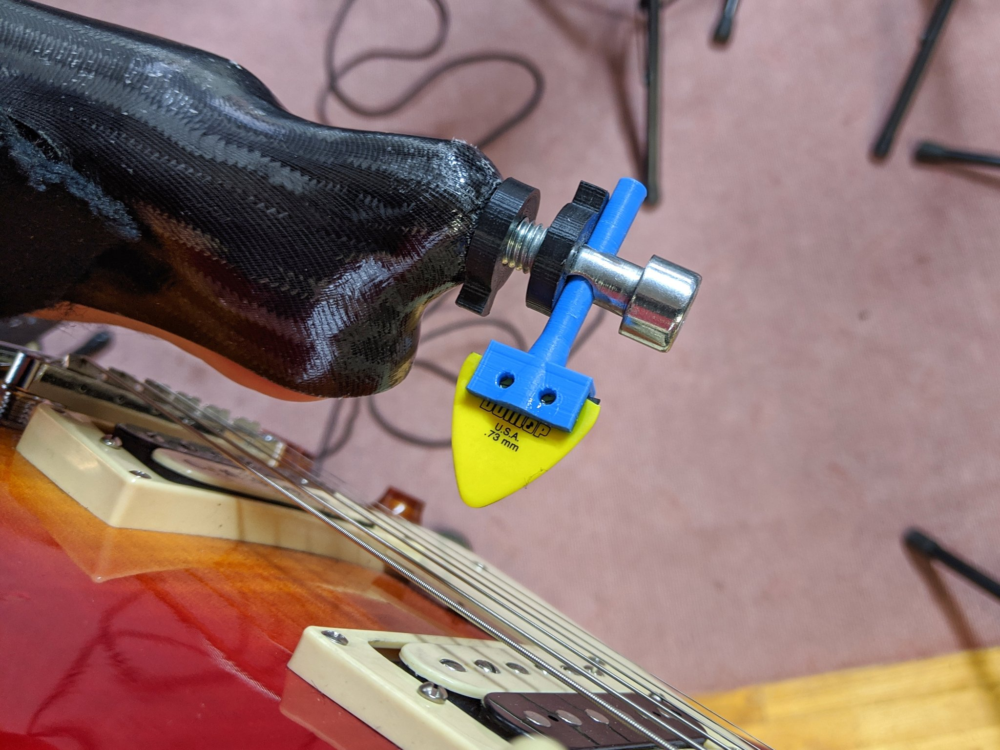
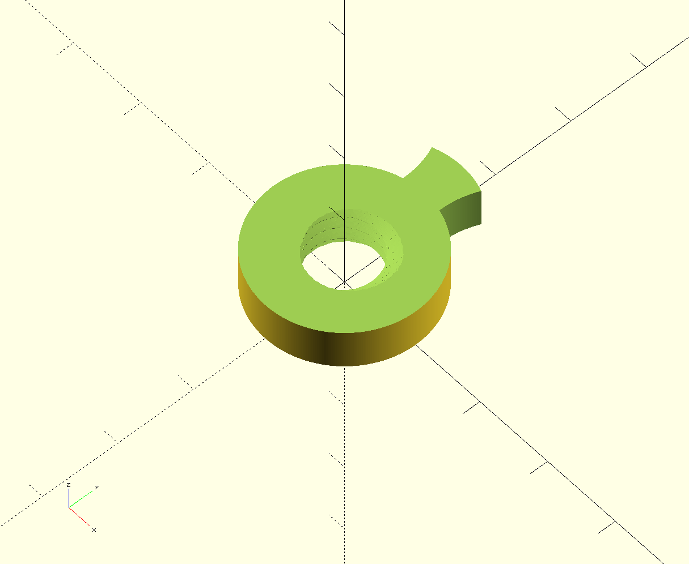
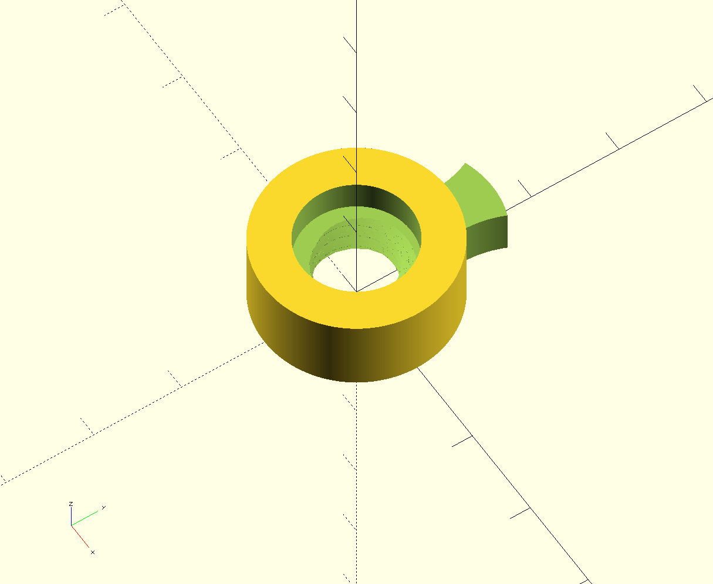
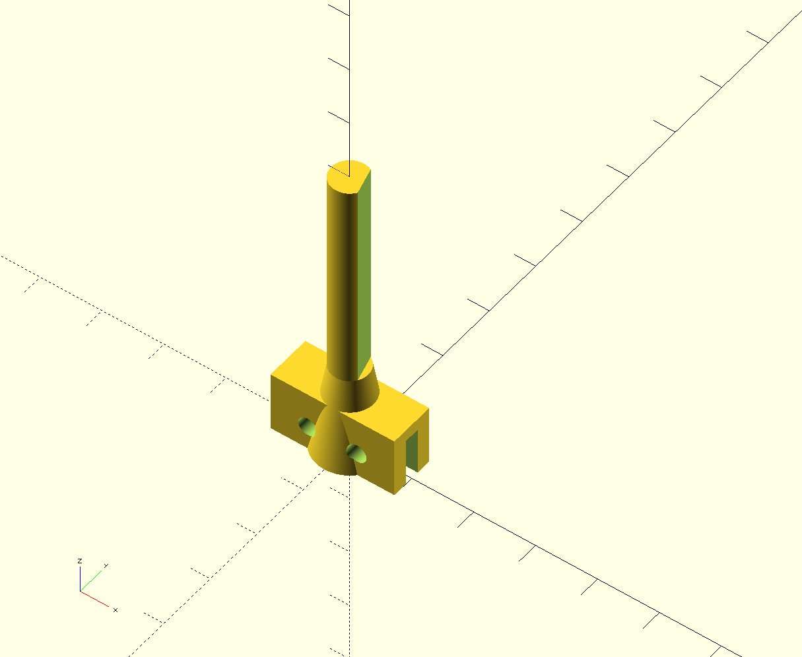
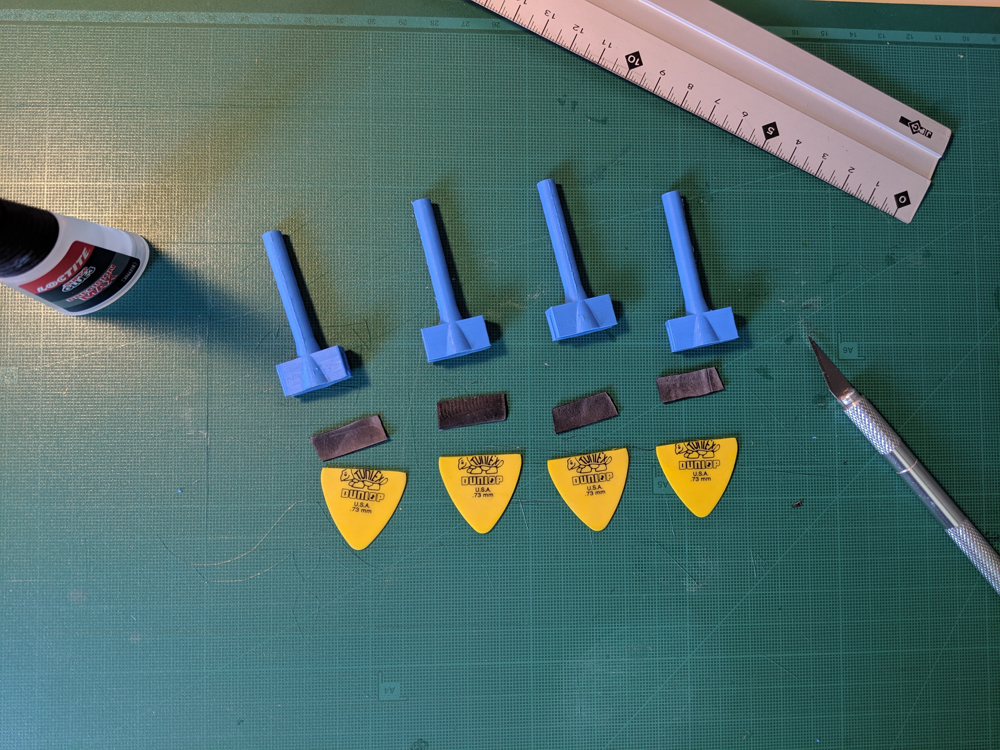

# Overview

This project is not meant to be a universal solution to all hand-lacking wanabee guitarists, it just fits my handicap. I'm sharing it so that anyone having the same kind of disability as mine, no hand with a short stump after the elbow, can give it a try. I'm also sharing it so that any fellow maker can contribute by providing improvements and altenative takes.

# Building it

* [Requirements](#Requirements)
* [Parts](#Parts)
* [Printing](#Printing)
* [Assembling](#Assembling)

## Requirements

* a missing hand (left or right, you choose)
* access to a 3D printer
* a guitar
* guitar picks

## Parts

The build is composed of several parts. The parts are:

* The socket element
* The mounting screw
* Two tightening bolts
* The pick holder
* The almighty pick of destiny

### Socket element

This part is not included in the project. It should be made by a prosthetist to fit properly the stump and prevent injuries. On mine the inner side is openned to allow me to mute the strings with the skin of my stump.
To allow the mounting screw to be held to the socket a M10 captive bolt is embedded in the socket.

### Mounting screw

The mounting screw used in this project is a CHC 10 stainless steel screw, typically used to fix climbing holds to walls. A 7mm unthreaded hole is drilled across the unthreaded part of the screw, just above the limit of the threading.
The mounting screw is to be screwed to the captive bolt held in the socket, a tightening bolt locking it in its desired position.

### Tightening bolts

Two different tightening bolts are used in the project:

* short\_tightening\_bolt.scad
* tightening_bolt.scad

#### Short tightening bolt

This bolt is intended to fix the mounting screw in position.

#### Tightening bolt

This bolt is intended to fix the pick holder within the mounting screw. The unthreaded part is ment to apply preasure against the shaft of the pick holder.

### Pick holder

 
Thi is the main part of the project. It is meant to hold the pick in the slot at the bottom. The flat surface on the shaft should be in front of the tightening bolt in order to provide a secure and tight locking. According to the shape of the stump, the angle of the flat surface must be adapted. See Printing section for details.  

### The almighty pick of destiny

Sadly we cannot show you pictures of aformentioned Pick Of Destiny since it has been reclaimed by the Devil. Tenacious D is currently on the case.

## Printing

The tightening bolts and the pick holder STL files are provided in the stl folder of the repository and can be used to print the parts on a 3D printer.

### Adjusting

The SCAD files are provided in the repository in the scad folder. The bolt files require the [NutsnBolts OpenSCAD library](https://github.com/JohK/nutsnbolts).

## Assembling

### Step 1

The first step of the assembling stage is to prepare the picks.

The larger side of the pick must be cut with a cutting tool in order to give it a straight edge that will be pushed inside the slot of the pick holder.

### Step 2

The second step is to put it all together

 
The part inserted in the pick holder can be padded with rubber (collected from an old bycicle air chamber for example). CA glue is used to fix the pick to the pick holder.

### Step 3

Insert the pick holder in the mounting screw, secure the tightening bolt, and play!

## Author

Marc Poppleton, marc.poppleton@gmail.com

## Contributing

I would love you to contribute to **pickholder**, check the [CONTRIBUTING](https://github.com/marcpoppleton/pickholder/blob/master/CONTRIBUTING.md) file for more info.

## License

**pickholder** is available under the Apache 2.0. See the [LICENSE](https://github.com/marcpoppleton/pickholder/blob/master/LICENSE) file for more info.

## Special Thanks
Special thanks to [Orthofiga](http://www.orthofiga.com/) for the custom socket and all the musicians or makers who have help me designing this tool.
